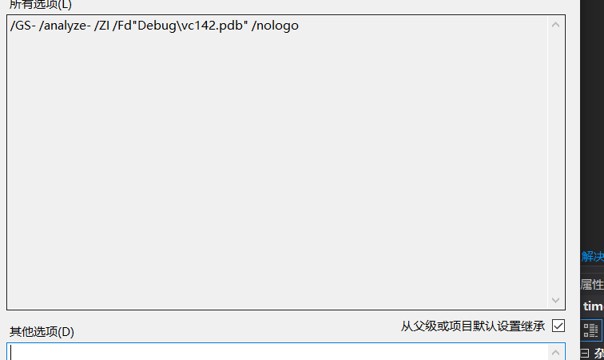
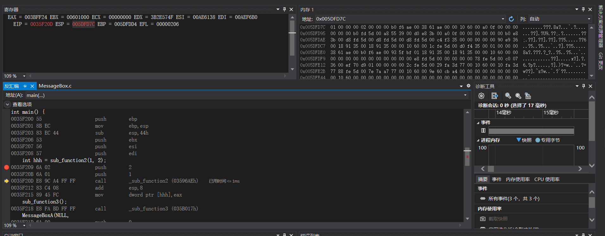

# 实验一

## 实验目的

熟悉函数调用过程中栈的变化，并在了解各寄存器作用

## 实验过程

### 建立工程

```c
#include <Windows.h>
#include <stdio.h>
#include <string.h>

int sub_function1() {
	int a = 100;
	a = a + 100;
	return a;
}
int sub_function2(int a, int b) {
	int c; //进行局部变量调试
	c = a + b;
	int ans = 0;
	ans = sub_function1();
	c = ans + c;
	return  c;
}
int sub_function3() {
	char a[10];
	strcpy(a, "aaaaaaaaaaaaaaaaaaaaaa"); //进行栈溢出漏洞测试
	return 100;
}

int main() {
	int hhh = sub_function2(1, 2);
	sub_function3();
	MessageBoxA(NULL,
		"helloworld",
		"I am from cuc!",
		MB_OK);
	return 100;
}
```

### 修改编译选项

保留/ZI和pdb文件路径两个选项



### 观察调试过程

在main函数的第一句下端点，观察反汇编、寄存器、内存等调试过程中的变化



首先观察到一共有10个寄存器，其中变化最多的为ebp，esp和eip。EBP保存当前栈帧的基地址，ESP保存当前栈顶地址，EIP为当前运行指令的地址，内存会随着push进去变量值而改变。

### 实验总结

1. 函数调用过程中栈的变化

   在函数调用时的入栈顺序：

   实参N~1——> Caller函数返回地址——> Caller函数EBP——> Callee函数局部变量1~N

   被调用函数的参数按照逆序依次压入栈内，然后将主调函数（caller）进行调用之后的下一条指令地址（EIP）压入栈用来保存主调函数的返回地址，再将调用函数的基地址（主调函数的EBP）压入栈内，然后将主调函数的ESP值赋给被调函数的EBP，然后改变ESP值来为被调函数局部变量预留空间。在调用结束后，将EBP值赋给ESP，使得ESP指向了被调函数的栈底，来释放局部变量；再将栈中主调函数的栈底地址弹出赋给EBP，然后弹出压入的下一条指令地址赋给EIP，这样就回到了主调函数的栈帧中。

2. 什么是栈帧

   栈帧就是存储在用户栈上的每一次函数调用涉及的相关信息的记录单元。其中包括函数的返回地址和参数、临时变量等

3. ebp寄存器在函数调用过程中的变化过程

   在函数调用开始前，ebp寄存器保存的为主调函数的基地址，在调用开始后，ebp寄存处首先被esp赋值，此时保存的为主调函数的栈顶地址，从这个位置开始将被调函数的数据压入栈，也就是ebp寄存器此时保存的时候被调函数的基地址。在调用结束后，会将保存在主调函数栈顶的主调函数基地址赋值给ebp寄存器，此时ebp寄存器保存主调函数的基地址。

4. ebp寄存器的作用

   存储栈帧的基地址，方便恢复到主调函数并继续进行下一步操作。

5. 函数的局部变量和参数保存位置、访问方式

   ```
       esp---> +-----------------+
               |     saved ebp   |
               +-----------------+
               |     loca 1      |
               +-----------------+
               |     loacal n    |
               +-----------------+
               |     param n     |
               +-----------------+
               |     param 2     |
               +-----------------+
               |	 param 1     |
               +-----------------+
               |     ret addr    |
       ebp---> +-----------------+
               |     saved ebp   |
               +-----------------+
   ```

   在访问时通过跳过指定的参数量得到对应的值，**访问栈里面的元素可以用-4(%ebp）或者8(%ebp)访问%ebp指针下面或者上面的元素**

6. 多层函数调用过程中栈的变化情况

   第一层被调用的函数保存主函数的基地址，然后保存调用时EIP的下一步，在这个被调用的函数里再次调用函数时，会继续保存此函数的基地址，然后保存此函数的EIP作为被调函数的return address。在调用结束后ebp返回主调函数的基地址位置，然后eip指针指向return address继续执行下面的指令。

7. 未赋初始值的局部变量值是如何形成的

   是前面栈帧使用后未清零而留下的数据。